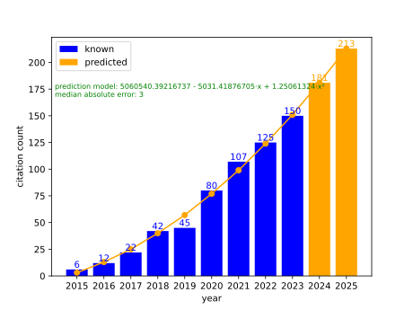
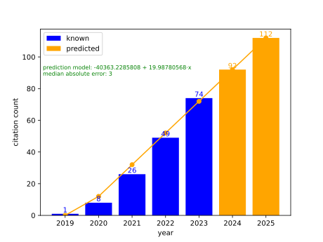

# Predicting Citation Counts

This repository contains data and a script for predicting the number of
citations for a given paper. This is a **toy example** of the analytic modeling process.

The example illustrates modeling of a discrete variable, which can only take on values in $\mathbb{N_0}$,using a continous approach, easier to model, followed by projecting the continous solution onto the valid discrete solution space. Additionally, one needs to select the best model out of several, combining both the model performance (root mean squared error which is minimized) and the number of parameters

The explicit models are polynomials of degree $1$ to $(n-1)$ where the data are $n$ equally spaced observations, $y = \mathbf{a}^T[1,x, x^2,...]+\epsilon$. Using these polynomial models makes sense because we know that the polynomial of degree $(n-1)$ interpolates the $n$ observations. That is, the root mean squared error for this model is zero. Or we can use an exponential model $y = ae^{bx}$. The script estimates all models and computes their corresponding [AICc](https://en.wikipedia.org/wiki/Akaike_information_criterion) scores (AIC for small samples), selecting the one with the lowest score.

Once the optimal model is obtained it is used to predict all the values for the existing years and the number of years into the future given on the command line. The resulting bar-graph and overlaid line graph are saved to a pdf file.

Installation and running (prediction of the next two years and use weights to increase the importance of observations closer to the latest available year):
```
conda env create -f environment.yml
conda activate citations_prediction

python citations_bar_plot_predictions.py data/design_citations.csv 2 --use_weights
python citations_bar_plot_predictions.py data/notebook_citations.csv 2 --use_weights
python citations_bar_plot_predictions.py data/r_citations.csv 2 --use_weights
```

The default output file type is *pdf*. If you want to use a different file type, it is determined by the output file name extension if you provide one. For example, when we automatically generate the images shown below we use the svg format:
```
python citations_bar_plot_predictions.py data/design_citations.csv 2 --use_weights --output_file_name results/design_citations.svg
```

Automatically generated results from the current data files (see the GitHub actions [workflow file](.github/workflows/main.yml)).
<table>
    <tr>
    <td>The Design of SimpleITK [<a href="https://doi.org/10.3389/fninf.2013.00045">pdf</a>]</td>
    <td></td>
    </tr>
    <tr>
    <td>SimpleITK image-analysis notebooks: a collaborative environment for education and reproducible research [<a href="https://doi.org/10.1007/s10278-017-0037-8">pdf</a>]</td>
    <td></td>
    </tr>
    <tr>
    <td>Image segmentation, registration and characterization in R with SimpleITK [<a href="https://doi.org/10.18637/jss.v086.i08">pdf</a>]</td>
    <td></td>
  </tr>
  </table>
